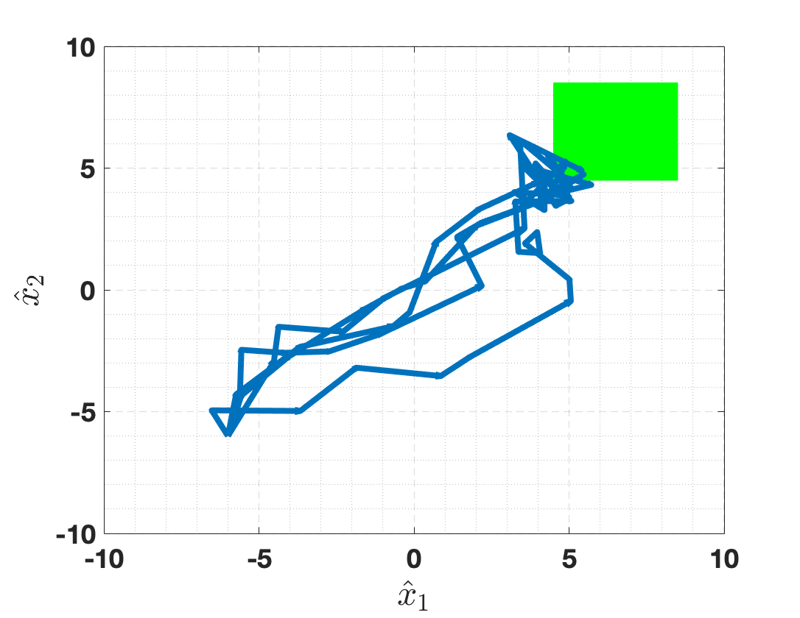
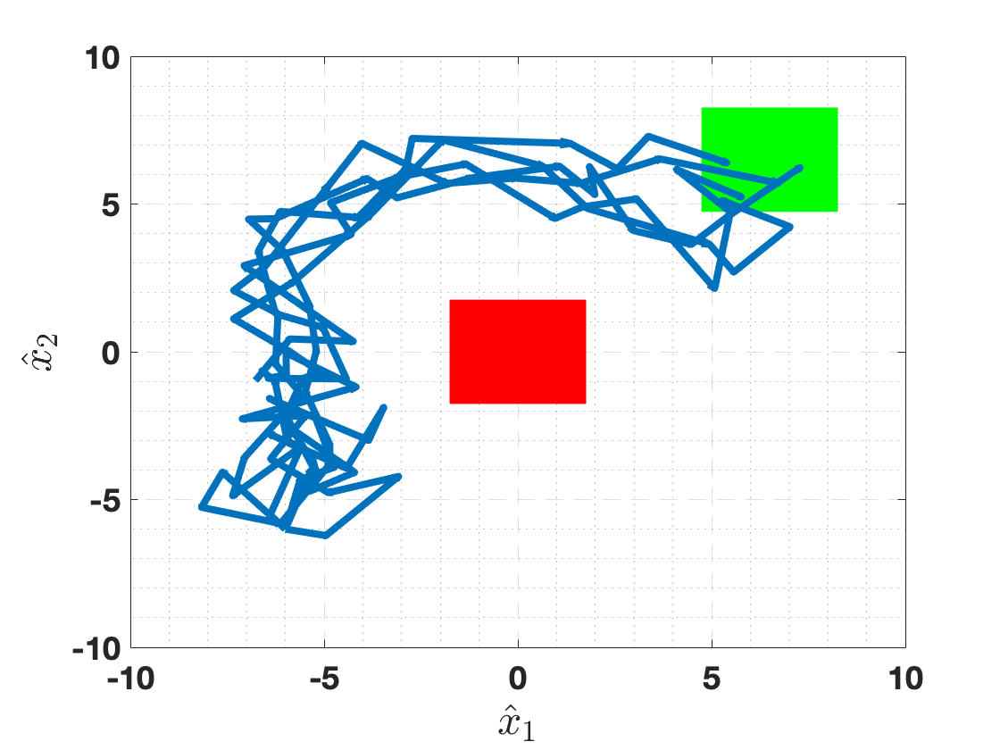
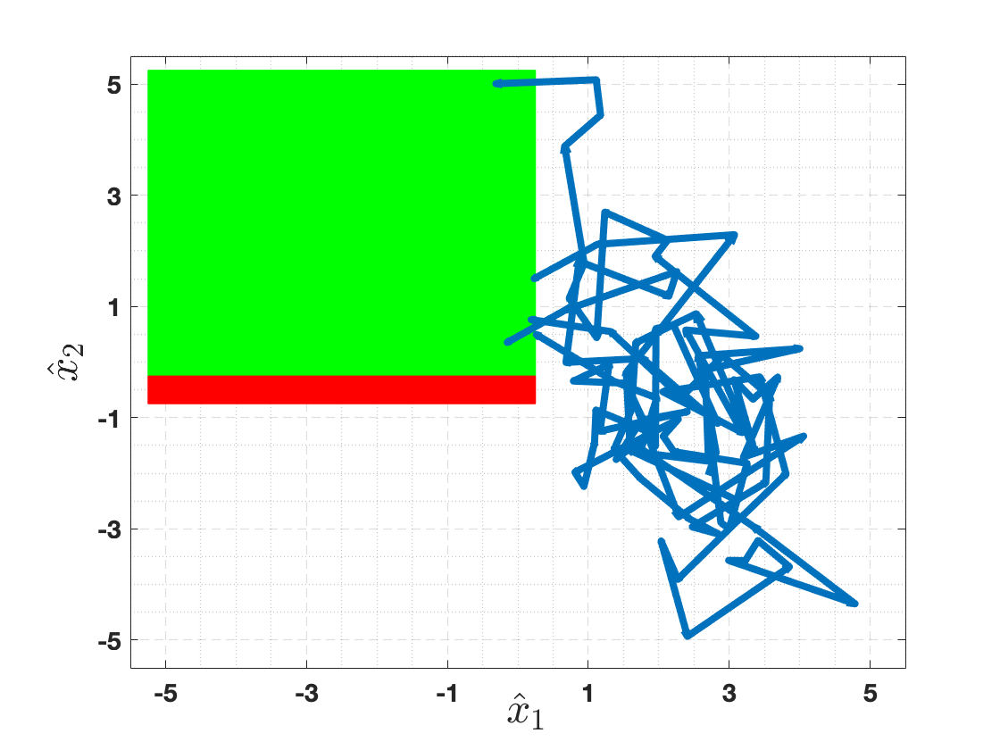
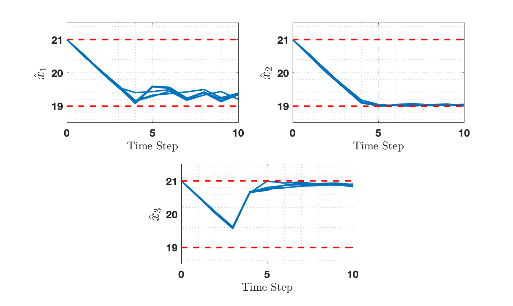
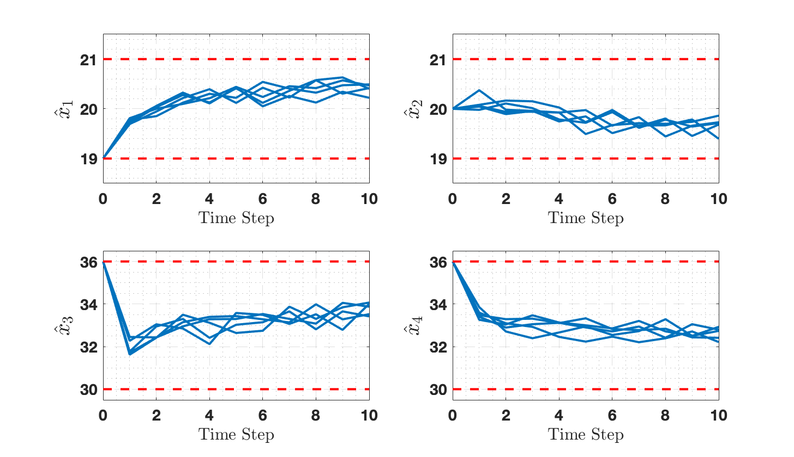

# IMPaCT Software Tool

[](https://github.com/Kiguli/IMPaCT/actions/workflows/docker.yml)

**IMPaCT**: <ins>**I**</ins>nterval <ins>**M**</ins>DP <ins>**Pa**</ins>rallel Construction for <ins>**C**</ins>ontroller Synthesis of Large-Scale S<ins>**T**</ins>ochastic Systems.

**IMPaCT** is an open-source software tool for the parallelized verification and controller synthesis of large-scale stochastic systems using *interval Markov chains* (IMCs) and *interval Markov decision processes* (IMDPs), respectively. The tool serves to (i) construct IMCs/IMDPs as finite abstractions of underlying original systems, and (ii) leverage *interval iteration algorithms* for formal verification and controller synthesis over infinite-horizon properties, including *safety*, *reachability*, and *reach-while-avoid*, while offering convergence guarantees.

**IMPaCT** is developed in C++ and designed using [AdaptiveCpp](https://github.com/AdaptiveCpp/AdaptiveCpp), an independent open-source implementation of SYCL, for adaptive parallelism over CPUs and GPUs of all hardware vendors, including Intel and NVIDIA. **IMPaCT** stands as the first software tool for the parallel construction of IMCs/IMDPs, empowered with the capability to leverage high-performance computing platforms and cloud computing services. Specifically, parallelism offered by **IMPaCT** effectively addresses the challenges arising from the state-explosion problem inherent in discretization-based techniques applied to large-scale stochastic systems.

## Table of Contents
- [Related Paper](#related-paper)
- [Installation](#installation)
- [Examples](#examples)
- [Reporting Bugs](#reporting-bugs)
- [Acknowledgements](#acknowledgements)
- [License](#license)

## Related Paper
For more information about the underlying research, you can find the related arXiv paper [here](https://arxiv.org/abs/2401.03555) or a local pdf copy in the repository.

### Authors
- [Ben Wooding](https://woodingben.com)
- [Abolfazl Lavaei](https://lavaei-cps.de/)

### Citing IMPaCT
```
@misc{wooding2024impact,
      title={IMPaCT: Interval MDP Parallel Construction for Controller Synthesis of Large-Scale Stochastic Systems}, 
      author={Ben Wooding and Abolfazl Lavaei},
      year={2024},
      eprint={2401.03555},
      archivePrefix={arXiv},
      primaryClass={eess.SY}
}
```

## Installation

The easiest way to install and run the tool would be using the image that can be downloaded from this repository by going to packages in the right-hand side menu. You can also build the docker image [Dockerfile](./Dockerfile) yourself and you can use the docker [notes](./Docker_instructions.md) to help (kindly put together for us by Ernesto Casablanca).

For your local machine (or a virtual machine) if it runs ubuntu 22.04, or equivalent, an installation script [install_ubuntu22.sh](./install_ubuntu22.sh) can be easily used by running these terminal commands in the respective folder:

`chmod +x install_ubuntu22.sh` to make the file executable followed by `sudo ./install_ubuntu22.sh` to install all the packages and dependencies.

You will need to install the parts for your specific GPU seperately, please see the AdaptiveCpp project for these installation details. 

For more detailed step by step manual installation instructions for Mac and Linux, please refer to the [Installation Guide](./installation.md). These can be a little bit finicky, particularly trying to install AdaptiveCpp on your machine.

We believe it should be possible to install the tool also for Windows, we have not tried this ourselves, do let us know if you have success!

## Examples

For detailed instructions on how to run and adjust the examples, or how to create your own examples, please refer to the [setup guide](./setup.md) file.

Here are some examples demonstrating the usage of the code:

### Example 1 - 2D Robot Reaching a Target
<p align="center">

</p>
  
A 2D robot controller is synthesized over an infinite-time horizon with the goal of reaching the target region in green, see [ex_2Drobot-R-U](./examples/ex_2Drobot-R-U/).

### Example 2 - 2D Robot Reaching a Target while Avoiding a Region

<p align="center">

</p>

A 2D robot controller is synthesized over an infinite-time horizon with the goal of reaching the target region in green, while avoiding the unsafe region marked in red, see [ex_2Drobot-RA-U](./examples/ex_2Drobot-RA-U/).

### Example 3 - 3D Autonomous Vehicle Reaching a Target while Avoiding a Region
<p align="center">

</p>

A 3D autonomous vehicle controller is synthesized over an infinite-time horizon with the goal of reaching the target region in green, while avoiding the unsafe region marked in red, see [ex_3Dvehicle-RA](./examples/ex_3Dvehicle-RA/).

### Example 4 - 3D Room Temperature Remaining in a Safe Region
<p align="center">

</p>

A 3D room temperature model is synthesized over a finite-time horizon of 10 steps with the goal of remaining inside of the safe region, bounded by the red dashes, see [ex_3Droom-S](./examples/ex_3Droom-S/).

### Example 5 - 4D Building Automation System Remaining in a Safe Region
<p align="center">

</p>

A 4D building automation system controller is synthesized over a finite-time horizon of 10 steps with the goal of remaining inside of the safe region, bounded by the red dashes, see [ex_4DBAS-S](./examples/ex_4DBAS-S/).

### Testing the Examples
For IMC/IMDP construction for verification/synthesis, we have deliberately provided some smaller examples that can run on small personal computers as well as providing larger models that may require more power machines.

Smaller Examples: [ex_2Drobot-R-U](./examples/ex_2Drobot-R-U/), [ex_2Drobot-R-D](./examples/ex_2Drobot-R-D/), [ex_4DBAS-S](./examples/ex_4DBAS-S/),

Larger Examples: [ex_3Dvehicle-RA](./examples/ex_3Dvehicle-RA/), [ex_3Droom-S](./examples/ex_3Droom-S/), [ex_5Droom-S](./examples/ex_5Droom-S/), [ex_7DBAS-S](./examples/ex_7DBAS-S/), [ex_14Dstochy-S](./examples/ex_14Dstochy-S/)

### Configuration for New Examples
The most helpful and descriptive example is [ex_2Drobot-R-D](./examples/ex_2Drobot-R-D/) which has plenty of additional comments in the configuration file to aid the user to design their own configuration file, please all see the details in the [setup guide](./setup.md). The other examples are also helpful, but omit some of the unused functions. The majority of examples provide the code for both infinite-time horizon and finite-time horizon with one choice commented out. Below is a list of the type of case studies that the user may wish to use and an example demonstrating that type of case study:
- Verification: [ex_7DBAS-S](./examples/ex_7DBAS-S)
- Reachability *without* Disturbance: [ex_2Drobot-R-U](./examples/ex_2Drobot-R-U)
- Reachability *with* Disturbance: [ex_2Drobot-R-D](./examples/ex_2Drobot-R-D)
- Reach-while-Avoid *without* Disturbance: [ex_2Drobot-RA-U](./examples/ex_2Drobot-RA-U)
- Reach-while-Avoid *with* Disturbance: [ex_2Drobot-RA-U](./examples/ex_2Drobot-RA-D)
- Safety: [ex_4DBAS-S](./examples/ex_4DBAS-S)
- Multivariate normal distributions: [ex_multivariateNormalPDF](./examples/ex_multivariateNormalPDF)
- custom distributions: [ex_customPDF](./examples/ex_customPDF)
- Loading source files into **IMPaCT** for synthesis: [ex_load_reach](./examples/ex_load_reach)
- Dealing with Absorbing states: [ex_load_safe](./examples/ex_load_safe)
- Using the GPU [ex_GPU](./examples/ex_GPU)

## Reporting Bugs
Please get in contact if you wish to report any bugs, we will do our best to resolve these in a timely manner. When contacting us, please provide as many details as you can regarding the bug: e.g. what occurred, why you think it happened, and what you think the fix would be?

## Acknowledgements

We want to take the time to thank some people who were generous in giving their time to the support of this tool.

- Sadegh Soudjani who assisted with some of the discussions in the early stages of this work.
- Ernesto Casablanca who kindly provided the Dockerfile that we provide for the tool.
- Omid Akbarzadeh, Ali Aminzadeh, Jamie Gardner, Milad Kazemi, Marco Lewis, Oliver Sch&ouml;n, and Mahdieh Zaker, who assisted with debugging the installation instructions.
- Max Planck Institute, and Tobias Kaufmann, for providing access and support with using the computing infrastructure used for simulations.

## License
This project is licensed under the [MIT License](./LICENSE) see the file for details.
