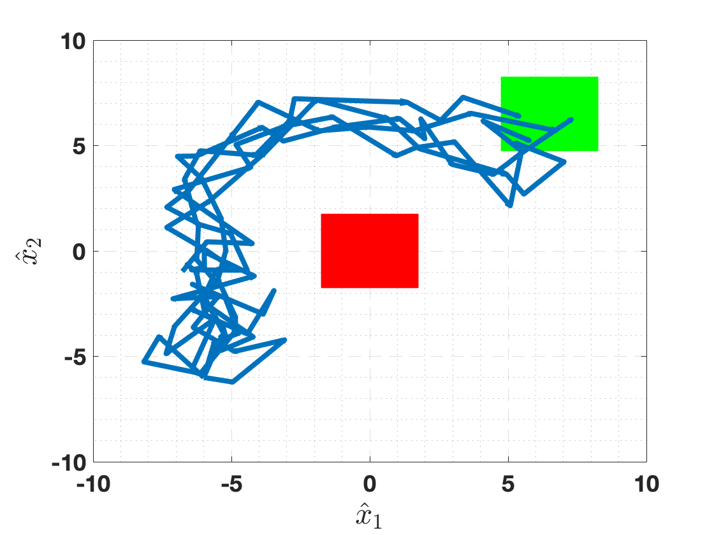
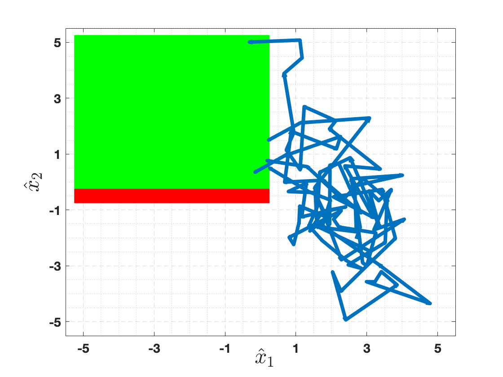

===========
Reach-Avoid
===========

Synthesize a controller that reaches a target region while avoiding unsafe regions.
IMPaCT automatically detects reach-avoid when both target and avoid regions are defined.

2D Robot Reach-Avoid --- Undisturbed (``ex_2Drobot-RA-U``)
==========================================================

**System:**

- **Dimensions**: 2D state, 2D input
- **Target**: Green region
- **Avoid**: Red region
- **Specification**: Infinite-horizon reach-while-avoid

The configuration uses ``setTargetAvoidSpace()`` to define both regions simultaneously.

**Run:**

.. code-block:: bash

   cd examples/ex_2Drobot-RA-U
   make && ./robot2D

2D Robot Reach-Avoid --- Disturbed (``ex_2Drobot-RA-D``)
=========================================================

Same reach-avoid problem with additive disturbance.

**Run:**

.. code-block:: bash

   cd examples/ex_2Drobot-RA-D
   make && ./robot2D

3D Autonomous Vehicle (``ex_3Dvehicle-RA``)
============================================

A 3D autonomous vehicle controller navigates to a target region while avoiding
obstacles. This is a larger example that demonstrates scaling to higher dimensions.

**System:**

- **Dimensions**: 3D state, 2D input
- **Specification**: Infinite-horizon reach-while-avoid

**Run:**

.. code-block:: bash

   cd examples/ex_3Dvehicle-RA
   make && ./vehicle3D
