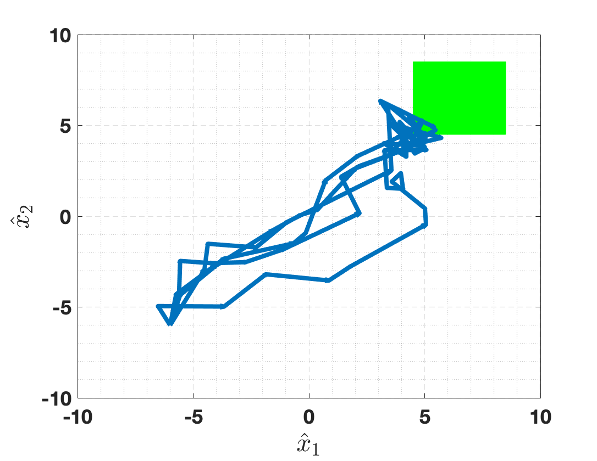

============
Reachability
============

Synthesize a controller that drives the system to a target region.

2D Robot --- Undisturbed (``ex_2Drobot-R-U``)
=============================================

A 2D mobile robot navigates to a target region using synthesized control inputs.

**System:**

- **Dimensions**: 2D state (position), 2D input (speed, angle)
- **State space**: :math:`[-10, 10]^2`, step size 1
- **Input space**: :math:`[-1, 1]^2`, step size 0.2
- **Dynamics**: :math:`x_{k+1} = x_k + 2u_0 \cos(u_1),\; y_{k+1} = y_k + 2u_0 \sin(u_1)`
- **Noise**: Diagonal Gaussian, :math:`\sigma = \sqrt{1/1.333}`
- **Target**: Square region :math:`[5, 8]^2`
- **Specification**: Infinite-horizon reachability (pessimistic)

**Run:**

.. code-block:: bash

   cd examples/ex_2Drobot-R-U
   make && ./robot2D

This is the simplest example and serves as the basis for the :doc:`/getting-started/quickstart`.

2D Robot --- Disturbed (``ex_2Drobot-R-D``)
============================================

Same system with an additive disturbance input. This is the most thoroughly
commented example and is recommended for understanding the configuration file format.

**Additional features:**

- 2D disturbance space
- Three-parameter dynamics: ``function<vec(const vec&, const vec&, const vec&)>``
- Demonstrates both infinite and finite horizon (finite is commented out)

**Run:**

.. code-block:: bash

   cd examples/ex_2Drobot-R-D
   make && ./robot2D
