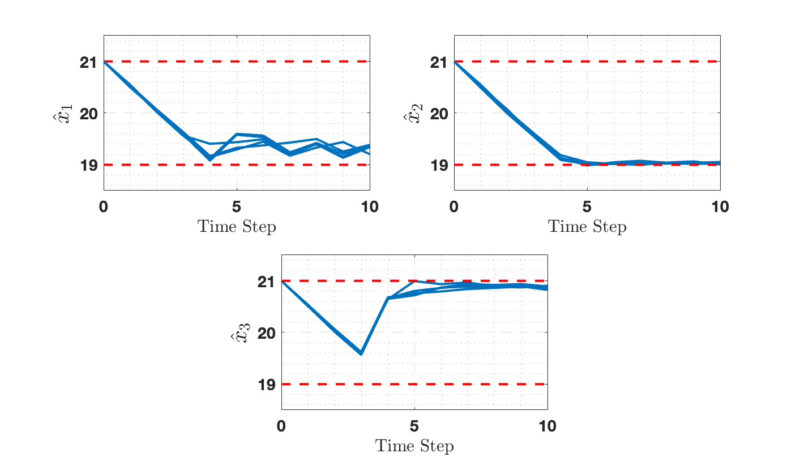
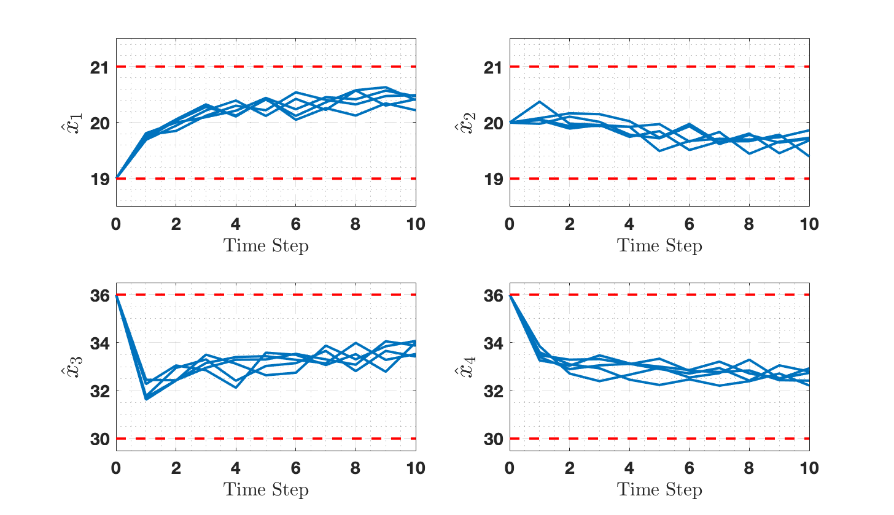

======
Safety
======

Synthesize a controller (or verify) that the system remains within a safe region.
In safety specifications, the entire state space is the safe region by default.

3D Room Temperature (``ex_3Droom-S``)
======================================

A 3D room temperature model is controlled to stay within safe temperature bounds
(shown by red dashes) over a finite time horizon of 10 steps.

**Run:**

.. code-block:: bash

   cd examples/ex_3Droom-S
   make && ./room3D

4D Building Automation (``ex_4DBAS-S``)
========================================

A 4D building automation system controller maintains temperatures in 4 rooms
within safe bounds over 10 time steps.

This is a small example suitable for personal computers.

**Run:**

.. code-block:: bash

   cd examples/ex_4DBAS-S
   make && ./bas4D

5D Room Temperature (``ex_5Droom-S``)
======================================

Extension of the 3D room temperature model to 5 dimensions. Requires more
computational resources.

**Run:**

.. code-block:: bash

   cd examples/ex_5Droom-S
   make && ./room5D

7D Building Automation --- Verification (``ex_7DBAS-S``)
=========================================================

A 7D building automation system with **no control inputs** (``dim_u = 0``).
IMPaCT automatically performs **verification** (IMC) rather than synthesis,
returning satisfaction probabilities for each state.

**Run:**

.. code-block:: bash

   cd examples/ex_7DBAS-S
   make && ./bas7D

14D Stochastic System (``ex_14Dstochy-S``)
===========================================

The highest-dimensional example, demonstrating IMPaCT's scalability to 14
dimensions. This requires significant computational resources.

**Run:**

.. code-block:: bash

   cd examples/ex_14Dstochy-S
   make && ./stochy14D
